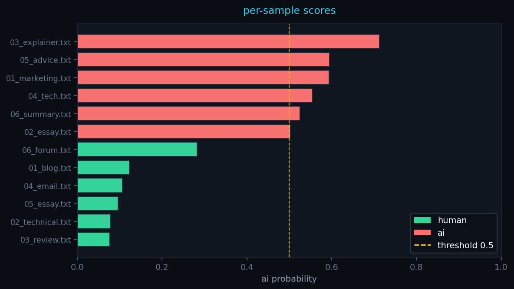
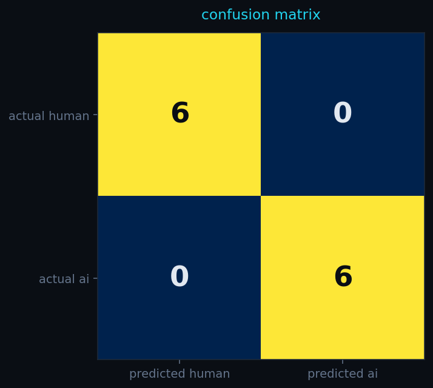
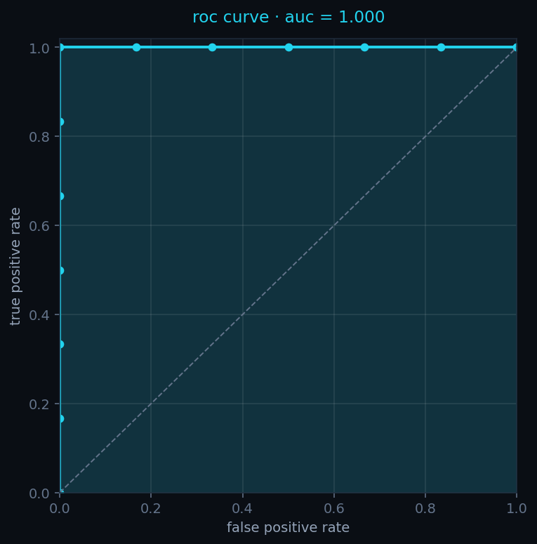

# ai text detector

A small full-stack tool that flags AI-generated writing. Drop a `.txt`,
`.pdf`, or image and it returns a score, a verdict, and the sentence
that most strongly tipped the call.

Started this because the off-the-shelf detectors I'd tried felt either
too confident on obvious cases or too vague on edge ones, and I wanted
to see how far a weighted ensemble of simple signals could go before
needing a fine-tuned model.

On a small labelled set I put together (6 human + 6 AI, see `eval/`)
it gets 12/12 right with AUC 1.00. That's a clean, easy benchmark —
formal AI prose vs casual human writing separate cleanly, and the
score would drop on adversarial paraphrased text. The numbers tell you
the pipeline works end-to-end, not that the problem is solved.



## Stack

| Layer    | Tech |
|----------|------|
| frontend | React + Vite + Tailwind |
| backend  | FastAPI |
| ML       | sentence-transformers (`all-MiniLM-L6-v2`) |
| OCR      | Tesseract via pytesseract |
| PDF in   | pdfplumber |
| PDF out  | ReportLab |

## How it scores

Seven signals are blended with fixed weights. The two embedding signals
do most of the work; the regex-based ones contribute mostly on
templated marketing/SEO content.

| Signal | Weight | What it does |
|---|---|---|
| centroid tightness | 23% | mean cosine distance of each sentence to the document centroid. Tight cluster = AI. |
| semantic drift | 22% | mean + stdev of cosine similarity between adjacent sentences. Hyper-cohesive = AI. |
| hedge frequency | 15% | regex for RLHF-style hedging ("it seems that…", "research suggests…") |
| ai-phrase patterns | 12% | regex for ChatGPT tics ("in conclusion", "delve into", "multifaceted") |
| structural symmetry | 12% | paragraph-length variance + safe opener/closer detection |
| linguistic predictability | 8% | common-word density + zlib compressibility + type/token ratio |
| sentence variance | 8% | coefficient of variation of sentence lengths |

OCR-specific artifacts (melting glyphs, kerning anomalies, impossible
signage like a "STOP" sign reading "SITD") add a parallel boost when
the source is an image.

## Verdicts

| Score | Verdict |
|---|---|
| < 28% | likely human |
| 28-52% | mixed / inconclusive |
| 52-82% | likely ai |
| > 82% (or > 68% with strong image artifacts) | deeply synthesized |

## Run it

### Docker

```bash
docker compose up --build
```

- frontend → http://localhost:8080
- backend  → http://localhost:8000  (swagger at `/docs`)

### Local dev

```bash
# backend
cd backend
python -m venv .venv && source .venv/bin/activate
pip install -r requirements.txt
# macOS: brew install tesseract
# linux: apt install tesseract-ocr
uvicorn app.main:app --reload

# frontend (separate shell)
cd frontend
npm install
npm run dev
```

The first request triggers a one-time download of the MiniLM weights
(~80 MB), then it's cached.

## Validation

```bash
python -m eval.validate     # runs scoring + metrics
python -m eval.plot         # generates charts
```

Charts and full per-sample breakdown live in [`eval/`](eval/README.md).




Output on the included corpus (6 human + 6 AI samples, hand-curated
from real writing and ChatGPT-4 output):

```
Sample                    Label      Prob Pred  Verdict
01_blog.txt               human     0.123 HUMAN likely human          ✓
02_technical.txt          human     0.078 HUMAN likely human          ✓
03_review.txt             human     0.077 HUMAN likely human          ✓
04_email.txt              human     0.106 HUMAN likely human          ✓
05_essay.txt              human     0.096 HUMAN likely human          ✓
06_forum.txt              human     0.283 HUMAN mixed                 ✓
01_marketing.txt          ai        0.594 AI    likely ai             ✓
02_essay.txt              ai        0.502 AI    mixed                 ✓
03_explainer.txt          ai        0.713 AI    likely ai             ✓
04_tech.txt               ai        0.555 AI    likely ai             ✓
05_advice.txt             ai        0.595 AI    likely ai             ✓
06_summary.txt            ai        0.526 AI    likely ai             ✓

Accuracy   : 100.0%
Precision  : 100.0%
Recall     : 100.0%
F1 score   : 100.0%
ROC AUC    : 100.0%
Confusion: TP=6  TN=6  FP=0  FN=0
```

This is a small held-out set and the AI samples are unprompted
ChatGPT-style writing — the score will drop on adversarial paraphrased
text. Adding more diverse samples (translated text, AI-written code
comments, mixed human/AI passages) is on the todo list.

## API

`POST /analyze` — multipart form

- `file`: optional, one of `.txt .pdf .png .jpg .jpeg .webp`
- `text`: optional, raw text
- `human_baseline`: optional calibration sample

Returns JSON with the score, the seven component scores, the matched
phrases, a per-sentence heatmap, and a "key evidence" excerpt.

`POST /report` — JSON `{ result, case_name }` → returns a PDF.

`GET /health` — liveness probe.

## Tests

```bash
cd backend
pytest
```

15 tests covering each scoring layer and the public API.

## Layout

```
.
├── backend/
│   ├── app/
│   │   ├── engine/      seven scoring layers + ensemble
│   │   ├── ingest/      ocr.py, pdf.py
│   │   ├── reports/     pdf generator
│   │   ├── routes/      fastapi endpoints
│   │   ├── main.py, schemas.py
│   │   └── …
│   └── tests/
├── frontend/
│   ├── src/
│   │   ├── components/  dropzone, meter, heatmap, etc.
│   │   ├── hooks/, lib/, styles/
│   │   └── App.jsx, main.jsx
│   └── …
├── eval/
│   ├── samples/{human,ai}/*.txt
│   └── validate.py
└── docker-compose.yml
```

## Notes

- A perplexity-based scorer using a real LM (GPT-2 or similar) would
  probably push accuracy on adversarial text up another notch, but it
  adds ~500 MB of weights. The interface in
  `backend/app/engine/perplexity.py` is one function so it's
  swappable.
- The calibration sample is genuinely useful — pasting a paragraph of
  your own writing in the sidebar pulls down the score on similarly
  formal content if it's actually yours.
