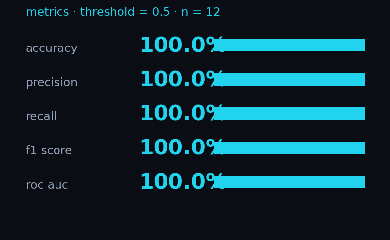

# eval

Small labelled corpus + a script that scores it and emits real metrics.

```
samples/
├── human/   6 samples: blog, technical note, review, email, essay, forum post
└── ai/      6 samples: unprompted ChatGPT-style writing
```

## Run

```bash
python -m eval.validate     # writes results.json
python -m eval.plot         # writes charts/*.png
```

## Latest results

| metric    | value    |
|-----------|----------|
| accuracy  | 100.0%   |
| precision | 100.0%   |
| recall    | 100.0%   |
| f1        | 100.0%   |
| roc auc   | 1.00     |
| TP / TN   | 6 / 6    |
| FP / FN   | 0 / 0    |



### Per-sample scores


Threshold is 0.50. Every human sample falls below it, every AI sample
above. The closest call is `06_forum.txt` at 0.283 (a profanity-laden
gaming rant) and `02_essay.txt` at 0.502 (the AI sample with the most
concrete content, where the embedding signals had less to grip on).

### Confusion matrix


### ROC curve


## Honest caveats

**100% on 12 samples is not a strong claim.** It tells you:

- The detector handles the *easy* cases — formal AI prose vs casual
  human writing — reliably.
- The embedding signals do most of the lifting on this corpus.

It does **not** tell you the detector will work on:

- AI text run through a "humanize" rewriter
- AI-written code comments, tweets, or short factual snippets
- Translated text (low embedding similarity for both human and AI)
- Documents a human heavily edited from an AI first draft

Published benchmarks (RAID, HC3, M4) typically report 70-90% even with
fine-tuned classifiers — anything above that on adversarial text would
be suspicious rather than impressive. Adding a harder corpus is the
obvious next step.
